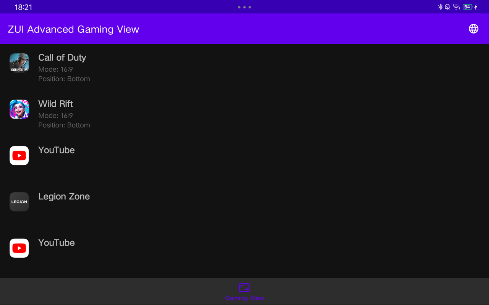
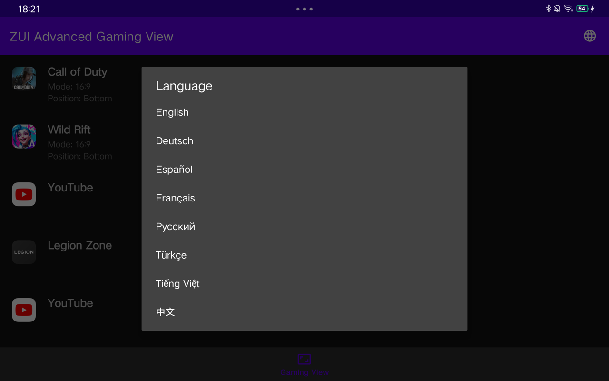

# ZuiAdvancedGamingView
Lesen Sie dieses Dokument in anderen Sprachen (gpt übersetzt): [Deutsch](README.de.md), [English](../README.md), [Español](README.es.md), [Français](README.fr.md), [Русский](README.ru.md), [Türkçe](README.tr.md), [Tiếng Việt](README.vi.md), [简体中文](README.zh.md)

## Screenshots

[](images/screenshot1.png)  
[](images/screenshot2.png)  
[](images/screenshot3.png)  
[](images/screenshot4.png)
[](images/screenshot5.png)

> [!warning]  
> **Diese App funktioniert nur auf Lenovo ZUI und wurde auf ZUI 16.0.336 (CN) getestet.**  
> **Nicht jeder Modus funktioniert mit jedem Spiel.**

## Funktionen

- Unterstützt alle Apps
- Unterstützt alle Ansichtsmodi für alle Apps
- 16:9-Modus hinzugefügt (gut für Content-Ersteller)

## Wichtige Einrichtungshinweise

Um sicherzustellen, dass die App korrekt funktioniert, müssen Sie ihr die erforderlichen Berechtigungen über ADB erteilen. Bitte führen Sie den folgenden Befehl aus:

```bash
adb shell pm grant io.github.cnpog.gamingview android.permission.WRITE_SECURE_SETTINGS
```

Falls Sie das APK nicht direkt installieren können, können Sie es auch über ADB mit dem folgenden Befehl installieren:

```bash
adb install --bypass-low-target-sdk-block ZuiAdvancedGamingView.apk
```

Dieser Befehl ermöglicht es Ihnen, die Sperre für ein niedriges Ziel-SDK zu umgehen und die App erfolgreich zu installieren.

## In Arbeit

Bitte beachten Sie, dass sich ZuiAdvancedGamingView derzeit in der Entwicklung befindet. Falls Sie auf Probleme stoßen oder Verbesserungsvorschläge haben, können Sie gerne ein Issue eröffnen!

Vielen Dank für Ihre Unterstützung und viel Spaß mit der App!

## Danksagungen

Besonderer Dank geht an [cuongmaz](https://xdaforums.com/m/cuongmaz.12936472/#about) für die technischen Informationen.
