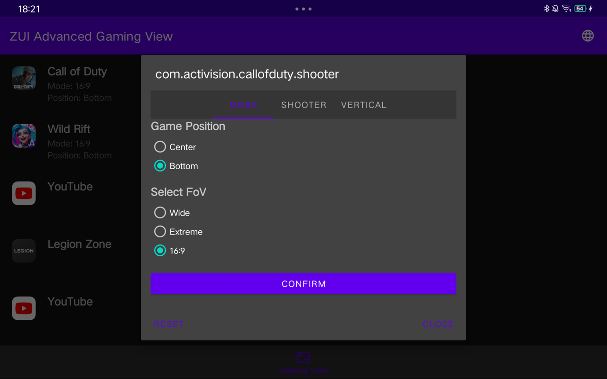
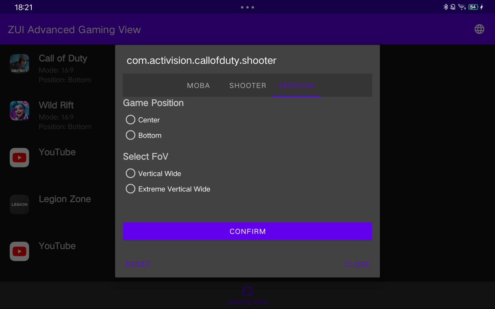

# ZuiAdvancedGamingView
Lisez ce document dans d'autres langues (traduit par gtp) : [Deutsch](README.de.md), [English](../README.md), [Español](README.es.md), [Français](README.fr.md), [Русский](README.ru.md), [Türkçe](README.tr.md), [Tiếng Việt](README.vi.md), [简体中文](README.zh.md)

## Captures d'écran

[](images/screenshot1.png)
[](images/screenshot2.png)
[](images/screenshot3.png)
[](images/screenshot4.png)

> [!warning]
> <b>Cette application ne fonctionnera que sur Lenovo ZUI et a été testée sur ZUI 16.0.336 (CN).</b>
> <b>Chaque mode ne fonctionne pas pour chaque jeu.</b>

## Caractéristiques

- Prend en charge toutes les applications
- Prend en charge tous les modes d'affichage pour toutes les applications
- Ajout du mode 16:9 (idéal pour les créateurs de contenu)

## Instructions d'installation importantes

Pour que l'application fonctionne correctement, vous devez lui accorder les autorisations nécessaires via ADB (ADB). Veuillez exécuter la commande suivante :

```bash
adb shell pm grant io.github.cnpog.gamingview android.permission.WRITE_SECURE_SETTINGS
```

Si vous ne pouvez pas installer l'APK directement, vous pouvez également l'installer via ADB avec la commande suivante :

```bash
adb install --bypass-low-target-sdk-block ZuiAdvancedGamingView.apk
```

Cette commande permet de contourner le blocage de SDK de faible niveau et d'installer l'application avec succès.

## En cours de développement

Veuillez noter que ZuiAdvancedGamingView est actuellement en cours de développement. Si vous rencontrez des problèmes ou avez des suggestions d'amélioration, n'hésitez pas à ouvrir un problème !

Merci pour votre soutien et profitez de l'application !

## Crédits

Merci à [cuongmaz](https://xdaforums.com/m/cuongmaz.12936472/#about) pour les informations techniques.
