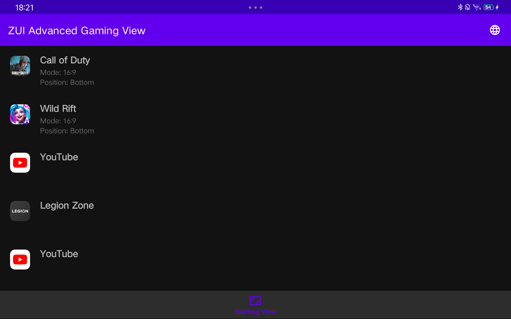
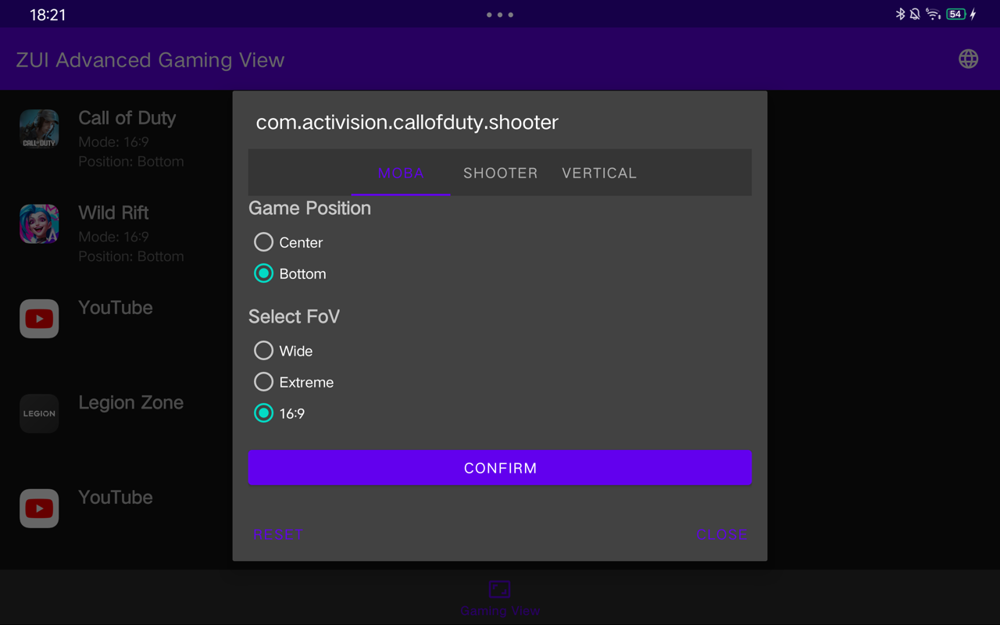
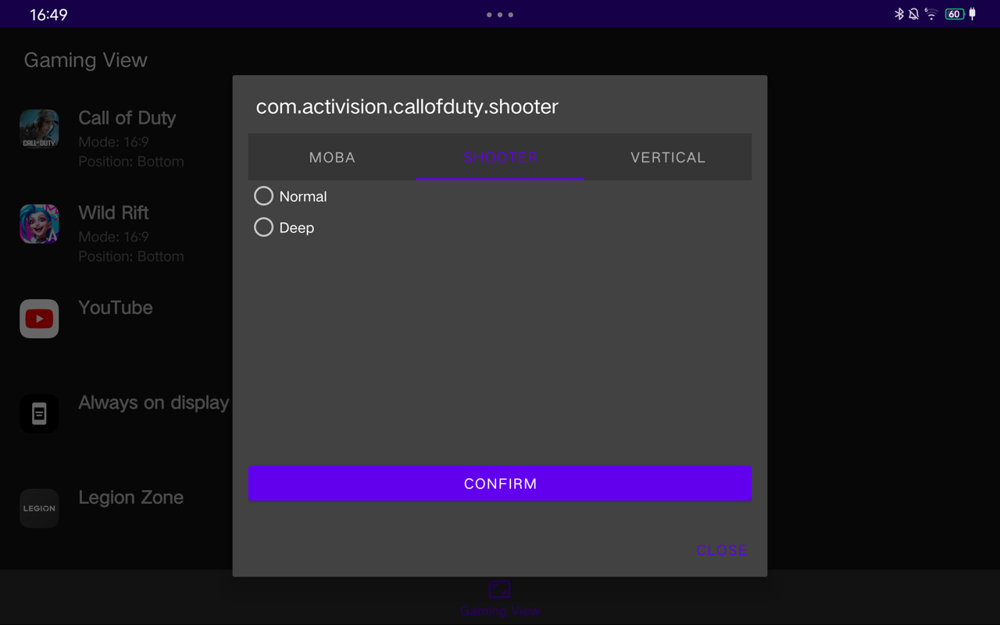
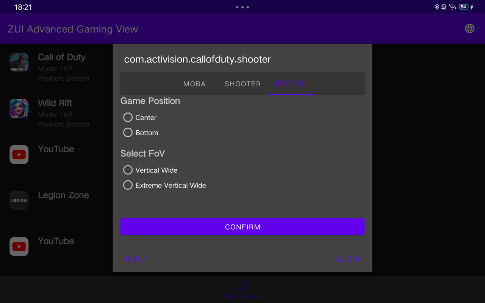

# ZuiAdvancedGamingView
Bu belgeyi diğer dillerde okuyun (gtp tarafından çevrildi): [Deutsch](README.de.md), [English](../README.md), [Español](README.es.md), [Français](README.fr.md), [Русский](README.ru.md), [Türkçe](README.tr.md), [Tiếng Việt](README.vi.md), [简体中文](README.zh.md)

## Ekran Görüntüleri

[](images/screenshot1.png)
[](images/screenshot2.png)
[](images/screenshot3.png)
[](images/screenshot4.png)

> [!warning]
> <b>Bu uygulama yalnızca Lenovo ZUI üzerinde çalışır ve ZUI 16.0.336 (CN) üzerinde test edilmiştir.</b>
> <b>Her mod her oyun için çalışmaz.</b>

## Özellikler

- Tüm uygulamalar için destek
- Tüm uygulamalar için tüm görüntüleme modları desteği
- 16:9 modu eklendi (içerik oluşturucular için uygundur)

## Önemli Kurulum Talimatları

Uygulamanın düzgün çalışmasını sağlamak için gerekli izinleri ADB üzerinden vermeniz gerekmektedir. Lütfen aşağıdaki komutu çalıştırın:

```bash
adb shell pm grant io.github.cnpog.gamingview android.permission.WRITE_SECURE_SETTINGS
```

APK'yi doğrudan yükleyemiyorsanız, ADB kullanarak aşağıdaki komutla da yükleyebilirsiniz:

```bash
adb install --bypass-low-target-sdk-block ZuiAdvancedGamingView.apk
```

Bu komut, düşük hedef SDK engelini aşmanızı sağlar ve uygulamayı başarılı bir şekilde yükler.

## Geliştirme Aşamasında

Lütfen ZuiAdvancedGamingView'in şu anda geliştirme aşamasında olduğunu unutmayın. Herhangi bir sorunla karşılaşırsanız veya geliştirme için önerileriniz varsa, bir sorun açmaktan çekinmeyin!

Desteğiniz için teşekkür ederiz ve uygulamanın keyfini çıkarın!

## Teşekkür

Teknik bilgiler için [cuongmaz](https://xdaforums.com/m/cuongmaz.12936472/#about) 'e özel teşekkürler.
